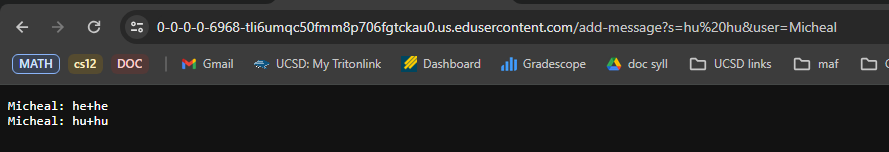
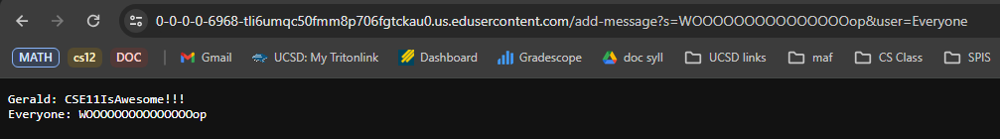
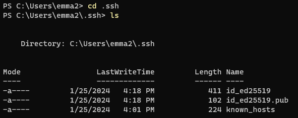
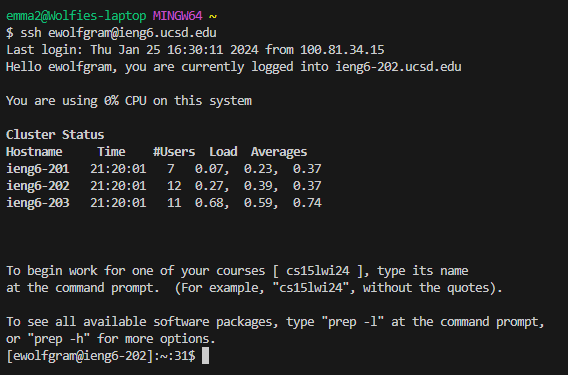

# Lab 2 Report

## Part 1

### Code for ChatServer
```
import java.io.IOException;
import java.net.URI;

class ChatHandler implements URLHandler {
  String lines = "";

  public String handleRequest(URI url) {
    //add-message?s=<string>&user=<string>
    String query = url.getQuery();
    if(url.getPath().equals("/add-message")) {
      String userName = "";
      String message = "";

      String userString = query.split("&")[1];
      if(userString.startsWith("user=")){
        userName = userString.split("=")[1];
      }
      String messageString = query.split("&")[0];
      if(messageString.startsWith("s=")){
        message = messageString.split("=")[1];
      }
      String fullMessage = userName + ": " + message;
      lines = lines + fullMessage + "\n";
      return lines;
    }
    return "this url needs a /add-message path";
  }
}

class ChatServer {
  public static void main(String[] args) throws IOException {
    if(args.length == 0){
      System.out.println("Missing port number!");
      return;
    }
    int port = Integer.parseInt(args[0]);
    Server.start(port, new ChatHandler());
  }
}
```

### Chat Server Running


**Which methods in your code are called?** When the code is compiled and run, both the main method and the handleRequest method are called on.

**What are the relevant arguments to those methods, and the values of any relevant fields of the class?** In the main method, the code checks for an argument that corresponds to the port number for the server. If there is no port number then an error message is received. When there is a port number, the main method parses it into an integer and uses the port number to start the server (in this case the part number is 6968). In the handleRequest method, the url argument is used to take the url of the server so that we can use it throughout the rest of the method body to declare certain actions. In this method, the relevant fields are `String query`, `String userName`, `String message`, `String userString`, `String messageString`, and `String fullMessage`.

**How do the values of any relevant fields of the class change from this specific request? If no values got changed, explain why.** From this specific request the fields that change are:
`String query` "s=he he&user=Micheal" changes to "s=hu hu&user=Micheal"
`String userName` "Micheal"
`String message` changes from "he he" to "hu hu"
`String userString` "user=Micheal"
`String messageString` "s= he he" changes to "s=hu hu"
`String fullMessage` "Micheal: he he" changes to "Micheal: hu hu"


**Which methods in your code are called?** When the code is compiled and run, both the main method and the handleRequest method are called on.

**What are the relevant arguments to those methods, and the values of any relevant fields of the class?** In the main method, the code checks for an argument that corresponds to the port number for the server. If there is no port number then an error message is received. When there is a port number, the main method parses it into an integer and uses the port number to start the server (in this case the part number is 6968). In the handleRequest method, the url argument is used to take the url of the server so that we can use it throughout the rest of the method body to declare certain actions. In this method, the relevant fields are `String query`, `String userName`, `String message`, `String userString`, `String messageString`, and `String fullMessage`.

**How do the values of any relevant fields of the class change from this specific request? If no values got changed, explain why.** From this specific request the fields that change are:
`String query` "s=CSE11IsAwesome!!!&user=Gerald" changes to "s=WOOOOOOOOOOOOOOOop&user=Everyone"
`String userName` "Gerald" changes to "Everyone"
`String message` changes from "CSE11IsAwesome!!!" to "WOOOOOOOOOOOOOOOop"
`String userString` "user=Gerald" changes to "user=Everyone"
`String messageString` "s=CSE11IsAwesome!!!" changes to "s=WOOOOOOOOOOOOOOOop"
`String fullMessage` "Gerald: CSE11IsAwesome!!!" changes to "Everyone: WOOOOOOOOOOOOOOOop"

## Part 2

Using the command line, show with ls and take screenshots of:

**The absolute path to the private key for your SSH key for logging into ieng6:**


**The absolute path to the public key for your SSH key for logging into ieng6:** (this is the one you copied to your account on ieng6, so it should be a path on ieng6's file system)


**A terminal interaction where you log into your ieng6 account without being asked for a password:**


## Part 3
**In a couple of sentences, describe something you learned from lab in week 2 or 3 that you didn't know before.** Something I have learned in the past two is how url handling works and how to program code that can handle each part of the url. For example, in lab we have learned how to section the url into parts (i.e. strings after "&" or "=" and paths after "/"). This helps us take each chuck and either print out, add it to a file or sentence, or search for keywords in a file.
