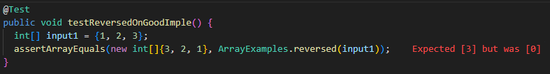
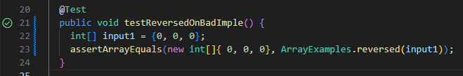

# Lab 3 Report - Bugs and Commands (Week 5)

## Part 1 - Bugs

Chosen bug: static int[] reversed(int[] arr)

1. A failure-inducing input for the buggy program, as a JUnit test and any associated code
```
@Test
public void testReversedFailOnGoodImple() {
  int[] intput1 = {1, 2, 3};
  assertArrayEquals(new int[]{3, 2, 1}, ArrayExamples.reversed(input1));
```
2. An input that doesn't induce a failure, as a JUnit test and any associated code
```
@Test
public void testReversedPassOnBadImple() {
  int[] input1 = {0, 0, 0};
  assertArrayEquals(new int[]{0, 0, 0}, ArrayExamples.reversed(input1));
```
3. The symptom, as the output of running the tests (provide it as a screenshot of running JUnit with at least the two inputs above)


5. The bug, as the before-and-after code change required to fix it (as two code blocks in Markdown)
Before
```
static int[] reversed(int[] arr) {
  int[] newArray = new int[arr.length];
  for(int i = 0; i < arr.length; i += 1) {
    arr[i] = newArray[arr.length - i - 1];
  }
  return arr;
}
```
After
```
static int[] reversed(int[] arr) {
  int[] newArray = new int[arr.length];
  for(int i = 0; i < arr.length; i += 1) {
    newArray[i] = arr[arr.length - i - 1];
  }
  return newArray;
}
```
**Why does this fix the issue?** In this code, the broken line appears inside the for loop. This method is supposed to copy over elements from one array into a new array but in reverse order. In the broken code, when the elements are copied over, it is putting elements from the new array into the old array. When the new array is created, all the values are defaulted to zero, so when the method runs, all the values in the array are switched to values from the new array which are all zeros. The code after fixes this issue by copying the old array values into the new array in reverse order.

## Part 2 - Researching Commands

Consider the commands less, find, and grep. Choose one of them.

Online, find 4 interesting command-line options or alternate ways to use the command you chose. 

To find information about the commands, a simple Web search like “find command-line options” will probably give decent results. 
There is also a built-in command on many systems called man (short for “manual”) that displays information about commands; 
you can use man grep, for example, to see a long listing of information about how grep works. Also consider asking ChatGPT!

For example, we saw the -name option for find in class. For each of those options, give 2 examples of using it on files and 
directories from ./technical. Show each example as a code block that shows the command and its output, and write a sentence 
or two about what it’s doing and why it’s useful.

That makes 8 total examples, all focused on a single command. There should be two examples each for four different 
command-line options. Many commands like these have pretty sophisticated behavior possible – it can take years to 
be exposed to and learn all of the possible tricks and inner workings.

Along with each option/mode you show, cite your source for how you found out about it as a URL or a description 
of where you found it. See the syllabus on Academic Integrity and how to cite sources like ChatGPT for this class.

