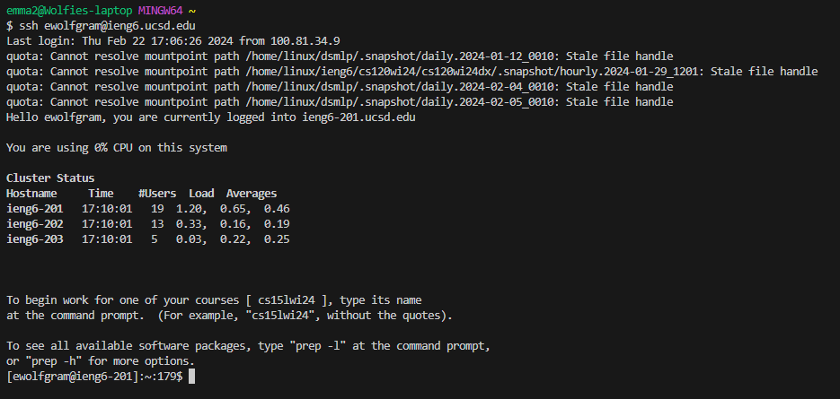
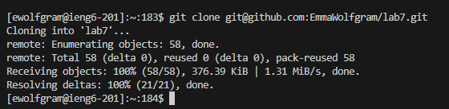
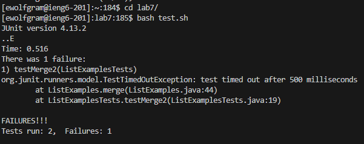
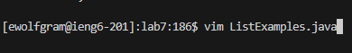
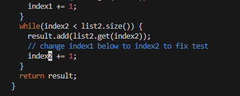
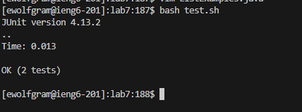
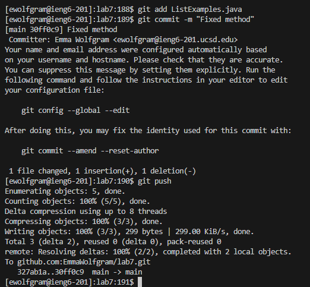

# Lab Report 4 - Vim

## 4. Log into ieng6

Keys typed: `ssh <space> ewolfgram@ieng6.ucsd.edu`

For this step, I typed the keys above which logged me into ieng6

## 5. Clone your fork of the repository from your Github account

Keys typed: `git <space> clone <ctrl>+v`

For this step, I typed `git clone` and then pasted my link (git@github.com:EmmaWolfgram/lab7.git) which cloned the git repository into my ieng6 account.

## 6. Run the tests, demonstrating that they fail

Keys typed: `cd <space> la <tab> <enter> bash <space> t <tab> <enter>`

For this step, I changed my directory to `lab7` and then used the bash script to run the tests

## 7. Edit the code file to fix the failing test

Keys typed: `vim <space> <shift>+L <tab> .java <enter>`

For this first part, I used Vim to go into the file in order to edit it and fix it

Keys typed: `/index1 <enter> n n n n n n n n n e i <delete> 2 <esc> :wq <enter>`

Once in the file, I searched for `index1` while in normal node and then used `n` to go down to the `index1` I needed to change. Once I was there I used `e` to go to the end of the word, then entered insert mode with `i`, used `deelte` to delete the 1, and replaced it with a `2`. Once that was done I used `esc` to escape from insert mode and saved using `:wq`. 

## 8. Run the tests, demonstrating that they now succeed

Keys typed: `<up> <up> <enter>`

The `bash test.sh` command was two up in the search history, so I used the arrow keys to access it.

## 9. Commit and push the resulting change to your Github account

Keys typed:
  1. `git <space> add <space> <shift>+L <tab> .java <enter>`
  2. `git <space> commit <space> -m "Fixed <space> method" <enter>`
  3. `git <space> push <enter>`

In the first keys typed, I used `git add` to add the new change to an area that will then need to be committed. In the second keys typed, I used `git commit` and then `-m ""` to commit the added change to the repository with the message `"Fixed method"`. In the third keys typed, I used `git push` to push the commit into the repository so that the change is now added and saved in my repository. 
