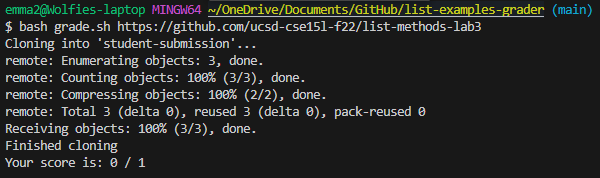

# Lab Report 5 - Putting it All Together

## Part 1 – Debugging Scenario

**1. The original post from a student with a screenshot showing a symptom and a description of a guess at the bug/some
   sense of what the failure-inducing input is.**

   Hello! I am writing the grade script for the list examples and I am getting some errors I don't really know how to go about fixing.
   When I run one of the repos that has failures, I get the correct output: 

   However when I then run the repo that is successful, as in has no errors I do not get the correct output: 

   From looking at the JUnit output text file I feel like that is why this is not working however, I do not know how to go about fixing it.
    

   From the first image, I can see how the script is getting the numbers to produce the grade correctly, however with the passing repo, it does not
   show failures and tests ran so there aren't two numbers to grab and show the score. I have an idea to write some code that finds if the output
   says "OK" in it somewhere because I believe that is produced every time successful code is run, however, I do not really know how to go about
   this without causing the current code to break and stop producing the correct output for the repo that has failures. Thank you for any advice!
   
**2. A response from a TA asking a leading question or suggesting a command to try**

From what I see you are on the right track. Think about creating other branches of your code that looks at what the contents are on the last line of the JUnit output. From there you can decide what should go in each branch to produce the correct output.

**3. Another screenshot/terminal output showing what information the student got from trying that, and a clear description of what the bug is.**

The bug that was in the code was that there was no case to handle the possibility of all the test cases passing. If you just used the original code it would not work because of the differing JUnit outputs from whether the code was successful or not. By handling the separate cases and determining whether the code passes or not, you can create a grade script that accounts for both these cases.

Output in terminal after fixing: 
 

Fixed code: 

**4. At the end, all the information needed about the setup including:**

**The file & directory structure needed:** 

**The contents of each file before fixing the bug:**

beginning code: 

**The full command line (or lines) you ran to trigger the bug:**

successful command: `$ bash grade.sh https://github.com/ucsd-cse15l-f22/list-methods-lab3`
failure-inducing command: `$ bash grade.sh https://github.com/ucsd-cse15l-f22/list-methods-corrected`

**A description of what to edit to fix the bug:**

To fix this bug I created an if-else statement that handled different cases. In the if branch I had it handle the case where the code in the repo fails and the JUnit output results in failure. From there, it takes the failures and tells you what your score is by subtracting the number of tests from the number of failures the code has. In the elif branch, I had it handle the case where if the code in the repo was passing, it got the number of tests from the last line and used that to output that the repo was successful and that the repo got a perfect score. 

